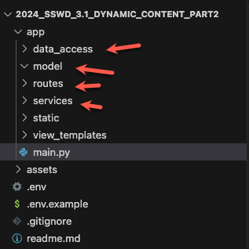
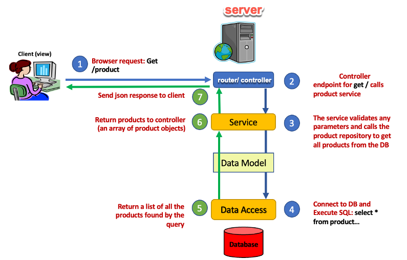
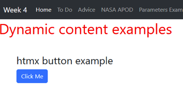
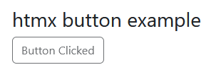
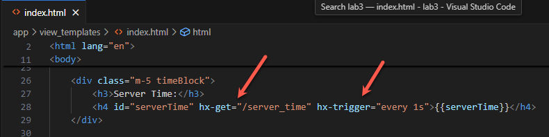
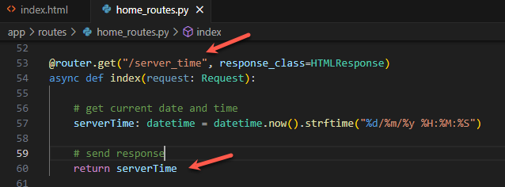
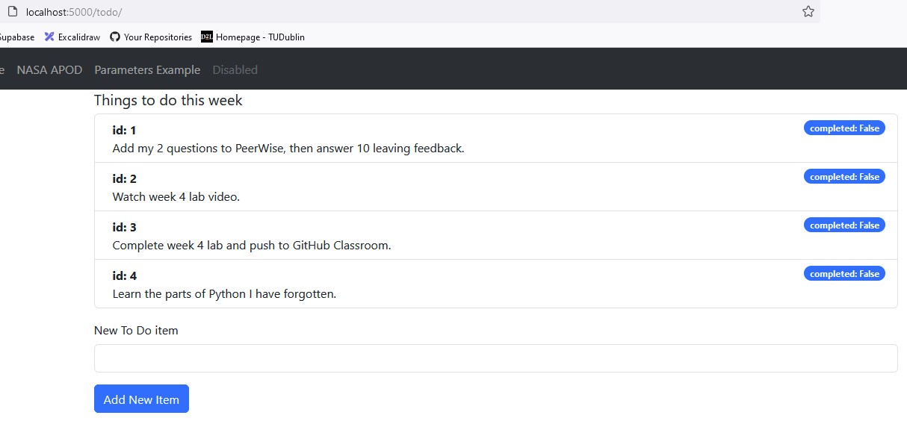
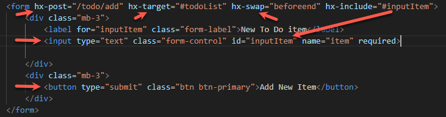

# Lab 4: Dynamic Content part 2


## Introduction

This lab has 2 parts.

1. **Application restructure**

   The application functionality will be divided into layers, each responsible for a specific task. This separation of concerns will make the application easier to maintain as we add functionality

2. **Dynamic content via Ajax and htmx**

   AJAX (**A**synchronous **J**avaScript **A**nd **X**ML) can be used to make web applications more interactive by allowing individual page elements to be updated with refreshing the entire page.

### Getting started

Start by cloning this repository and opening in VS Code.

1. Configure the Python Virtual Environment

   `python -m venv venv --prompt="lab4"`

2. Activate the Virtual Environment

   `venv\Scripts\activate`

3. Install dependencies

   `pip install fastapi uvicorn['standard'] jinja2 python-multipart httpx`

4. Setup the `.env` file, e.g. based on `.env.example`

5. Run the application (not yet!)

6. `uvicorn app.main:app --reload --port=5000`


## Part 1: Application Re-structure

You will notice that the app folder contains some new folders. These allow the application to be separated into different components, depending on functionality. As the application grows, this ensures that it is easier to manage and maintain.




Although it may not seem like it at first, this structure simplifies the application and makes it easier to maintain, secure, and scale. Note that the router/ controller cannot access the DB directly and must do so via the service layer. This is a summary of the functions provided by each layer:
1.	**Client** – provides the front-end view or user interface, e.g. a client-side website or mobile app
2.	**Router/Controller** – Incoming HTTP requests are routed to endpoints in the controller. Requests are handled by calling the appropriate service(s) and the response is sent back to the client.
3.	**Service** – Contains the application logic required to perform a function, e.g. validation, retrieving data, etc.
4.	**Data Model** – Representation of data used by the application (e.g. a product, user, etc.)
5.	**Data Access**– Functions to interact with data storage, e.g. using SQL.
6.	Database – The system where data used by the application is stored and managed.
The separation by function should allow a layer to be replaced without impacting the other layers – e.g. changing from MSSQL to MongoDB would only require changes to the Repository layer.





### 1.1. Working with the new structure

The first thing you will notice is that routes are missing from `main.py`. Instead, these should be defined separately in the routes folder.

1. Add a new file **`home_routes.py`** to **`app/routes`**. The routes defined in the previous lab will go here.

   First import dependencies and configure the new router. Add the following code to the start of **`app/routes/home_routes.py`**:

   ```python
   from fastapi import APIRouter
   from fastapi import Request
   from fastapi.responses import HTMLResponse
   from fastapi.templating import Jinja2Templates
   from datetime import datetime
   from starlette.config import Config
   
   # Load environment variables from .env
   config = Config(".env")
   
   # set location for templates
   templates = Jinja2Templates(directory="app/view_templates")
   
   # define a router instance
   router = APIRouter()
   ```

   The last line `router = APIRouter()` defines the router instance.

2. Add the routes. These are the same as the ones from the previous lab, except that that they are added to the router instance instead of directly to app (as we did previously in main.py).

   This code should be added after the existing code in  **`app/routes/home_routes.py`**:

   ```python
   # handle http get requests for the site root /
   # return the index.html page
   @router.get("/", response_class=HTMLResponse)
   async def index(request: Request):
   
       # get current date and time
       serverTime: datetime = datetime.now().strftime("%d/%m/%y %H:%M:%S")
   
       # note passing of parameters to the page
       return templates.TemplateResponse("index.html", {"request": request, "serverTime": serverTime })
   
   @router.get("/advice", response_class=HTMLResponse)
   async def advice(request: Request):
       
       # Define a request_client instance
       requests_client = request.app.requests_client
   
       # Connect to the API URL and await the response
       response = await requests_client.get(config("ADVICE_URL"))
   
       # Send the json data from the response in the TemplateResponse data parameter 
       return templates.TemplateResponse("advice.html", {"request": request, "data": response.json() })
   
   @router.get("/apod", response_class=HTMLResponse)
   async def apod(request: Request):
       requests_client = request.app.requests_client
       response = await requests_client.get(config("NASA_APOD_URL") + config("NASA_API_KEY"))
       return templates.TemplateResponse("apod.html", {"request": request, "data": response.json() })
   
   
   
   # https://www.getorchestra.io/guides/mastering-query-parameters-in-fastapi-a-detailed-tutorial
   @router.get("/params", response_class=HTMLResponse)
   async def params(request: Request, name : str | None = ""):
       return templates.TemplateResponse("params.html", {"request": request, "name": name })
   
   ```

3. Next import `home_routes` in `main.py` and include them in the `app` instance.

   As the starting point, **`main.py`**, remains an important part of the application. We have moved all of the application logic to other files but that functionality, e.g. the routes,  still need to be accessed.

   Add the following code, just under the existing imports, to import and setup the `main_routes`

   ```python
   from app.routes.home_routes import router as home_router
   
   main_router = APIRouter()
   
   main_router.include_router(home_router)
   ```

   At the very end of `main.py`, on the last line, add the following which adds the routes to the app instance, allowing it to handle requests.

   ```python
   # include routes in app
   app.include_router(main_router)
   ```

   

The application should now work exactly as before, but with a better structure. The separation into different folders, each mapping to a particular concern, will make the application easier to work on as more functionality is added.

## Part 2: Introduction to html and Ajax

This section will make full use of the new application structure while also introducing html and Ajax.

Ajax (**A**synchronous **J**avaScript **A**nd **X**ML) can be used to make web applications more interactive by allowing individual page elements to be updated with refreshing the entire page. Usually 

##### From https://developer.mozilla.org/en-US/docs/Glossary/AJAX:

> # Ajax
>
> Asynchronous JavaScript and XML (**Ajax**, or **AJAX**) is a web development technique in which a web app fetches content from  the server by making asynchronous HTTP requests, and uses the new  content to update the relevant parts of the page without requiring a  full page load. This can make the page more responsive, because only the parts that need to be updated are requested.
>
> Ajax can be used to create [single-page apps](https://developer.mozilla.org/en-US/docs/Glossary/SPA), in which the entire web app consists of a single document, which uses Ajax to update its content as needed.
>
> Initially Ajax was implemented using the [`XMLHttpRequest`](https://developer.mozilla.org/en-US/docs/Web/API/XMLHttpRequest) interface, but the [`fetch()`](https://developer.mozilla.org/en-US/docs/Web/API/Window/fetch) API is more suitable for modern web applications: it is more powerful,  more flexible, and integrates better with fundamental web app  technologies such as [service workers](https://developer.mozilla.org/en-US/docs/Web/API/Service_Worker_API). Modern web frameworks also provide abstractions for Ajax.
>
> This technique is so common in modern web development that the specific term "Ajax" is rarely used.


Ajax can be used directly in JavaScript but we will be using **[</> htmx](https://v1.htmx.org/)**, a small JavaScript library which extends HTML with new attributes which add Ajax functionality without requiring JS code.

From https://v1.htmx.org/ :

> htmx gives you access to [AJAX](https://v1.htmx.org/docs/#ajax), [CSS Transitions](https://v1.htmx.org/docs/#css_transitions), [WebSockets](https://v1.htmx.org/docs/#websockets) and [Server Sent Events](https://v1.htmx.org/docs/#sse)  directly in HTML, using [attributes](https://v1.htmx.org/reference/#attributes), so you can build  [modern user interfaces](https://v1.htmx.org/examples/) with the [simplicity](https://en.wikipedia.org/wiki/HATEOAS) and  [power](https://www.ics.uci.edu/~fielding/pubs/dissertation/rest_arch_style.htm) of hypertext
>
> htmx is small ([~14k min.gz’d](https://unpkg.com/htmx.org/dist/)),  [dependency-free](https://github.com/bigskysoftware/htmx/blob/master/package.json), [extendable](https://v1.htmx.org/extensions/),  IE11 compatible & has **reduced** code base sizes by [67% when compared with react](https://v1.htmx.org/essays/a-real-world-react-to-htmx-port/)


### 2.1 A simple example to illustrate

The first step is to load the htmx library from the CDN, see the [quick start guide](https://htmx.org/). 

 This can be added to any page, or in `app/view_templates/parials/dependencies.html` to include in every page.

```html
<!-- HTMX 2-->
<script src="https://unpkg.com/htmx.org@2.0.3"></script>
```

 The example will display a "click me" button. When clicked, an Ajax request will be sent to swap the button with another version labeled "button clicked."



1. Add the button html to `index.html`

   ```html
       <div class="m-5">
           <h3> </> htmx button example</h3>
           <!-- have a button POST a click via AJAX -->
           <button hx-post="/clicked" hx-swap="outerHTML" class="btn btn-primary">
               Click Me
           </button>
       </div>
   ```

   Note the `htmx` attributes on the `button` element:

   - **`hx-post="/clicked"`** sends a POST request to `/clicked` when the button is clicked.
   - **`hx-swap="outerHTML"`** swaps the current button element with whatever content is returned by the server
   - Only this element will be reloaded and not the entire page.

2. Add a route to handle **`/clicked`**. This should be defined in `app/routes/home_routes.py`. Its job is to handle the **POST** request, sending back an updated button.

   ```python
   @router.post("/clicked", response_class=HTMLResponse)
   async def clicked(request: Request):
       # note passing of parameters to the page
       return templates.TemplateResponse("./partials/clicked_button.html", {"request": request })
   ```

3. The request sends back the html defined in `/partials/clicked_button.html` which should look like this:

   ```html
     <!-- have a button POST a click via AJAX -->
     <button hx-post="/clicked" hx-swap="outerHTML" class="btn btn-sucess" disabled>
       Button Clicked
     </button>
   ```

Save your files and try it out. After clicking the button, the clicked button should be displayed:



Use the browser developer tools to inspect the button element so that you can observe the update after the button is clicked. Check the network tab in your browser dev tools and also the server-side terminal to observe the Ajax request/ response.


### 2.2. Updating `serverTime` via Ajax calls

Currently the server time displayed in `index.html` only updates when the page is first loaded. This example uses htmx and Ajax to update the server time every second.

1. Two `htmx` attributes are used:

- **`hx-get="/server_time"`** defines a  `GET` request for updates.
- **`hx-trigger="every 1s"`** defines the event which triggers the request. In this case a timer. This is called `polling` 



2. When called, the **`/server_time`** endpoint returns the current time. This is defined in `home_routes.py`, unlike the other routes it does not use an HTML template.

   

   

Save everything and try it out. You should observe the server time updating every second. Check the network tab in your browser dev tools and also the server-side terminal to observe the Ajax request/ responses.


### 2.3. Manage a list of 'Things to do'

In this example, the `/todo` route will return a page displaying a list of things to do. The example will make use of the new app structure, and will be divided across models, data_access, services, and routes.

The finished page will look like this, displaying a list and a form to add new items:



### 2.3.1. The Data Model

A `model` class will be defined to represent the only data object used in this example, a ToDo item. A **ToDo** has the following attributes:

- `id` - a unique number
- `details` - test describing the item
- `completed` - true or false
- `userId` - the id of the user who created this item.

To define the model class for ToDo, add **`todo.py`** to the `models` folder. The following code uses [Pydantic](https://docs.pydantic.dev/latest/), a Python data validation library, to define the class. (We will be using Pydantic for validation in future labs). Here is the class code, add it to `todo.py`

```python
# A model class for ToDo items
# See https://docs.pydantic.dev/latest/concepts/models/
from pydantic import BaseModel

class ToDo(BaseModel):
    id: int
    details: str
    completed: bool = False
    userId: int = 0
```

Notice that data types are defined for each attribute -these can be used to validate the model. Two of the attributes have default values.

### 2.3.2. Data Access

In later labs a database will be used to manage data access but for now we will use a list of sample data defined in **`app/data_access/todo_dba.py`** (add this file).

`todos.py` also defines two functions to return the to do list and add a new item to the list (two of the four CRUD operations).

```python
# import the model class
from app.models.todo import ToDo

# declare an emppty list to store todo items
todos_list = []

# define some sample data to display
t1 = ToDo(id=1, details="Add my 2 questions to PeerWise, then answer 10 leaving feedback.")
t2 = ToDo(id=2, details="Watch week 4 lab video.")
t3 = ToDo(id=3, details="Complete week 4 lab and push to GitHub Classroom.")
t4 = ToDo(id=4, details="Learn the parts of Python I have forgotten.")

# add the same objects to the list
todos_list.append(t1)
todos_list.append(t2)
todos_list.append(t3)
todos_list.append(t4)

# returns the todo list
def dataGetTodoList() :
    return todos_list

# add a new item to the list
def dataAddTodo(details : str) :
    # generate id based on list length and set details = the param value
    new_todo = ToDo(id = len(todos_list) + 1, details = details)
    
    # add the new item to the list
    todos_list.append(new_todo)

    # return the new todo object
    return new_todo
```

**The new application structure will make this code easier to swap to real database access functions later.**


### 2.3.3. A `Service` to access the data

This is a further layer of separation which avoids using calls which require a specific database or file time in route controllers. Again the goal is to make future changes easier.

Add **`todo_service.py`** to the `app/services` folder. It contains two functions to

1. **`getAllTodos()`**
2. **`addTodo()`**

```python
# import service functions
from app.data_access.todo_dba import dataGetTodoList, dataAddTodo

# get list of todos from data
def getAllTodos() :
    return dataGetTodoList()

# add new todo using data access
def addTodo(item : str) :    
    # add todo to the list (via dataaccess)
    new_todo = dataAddTodo(item)

    # return new todo
    return new_todo
```


### 2.3.4. Todo routes

The `todo` related route handlers will be defined separately from `home_routes.py`. Add **`todo_routes.py`** to `app/routes`. This follows the same pattern as the previous examples and contains two routes:

1. `/` is the default route which will return a page displaying the todo items
2. `/add` is POST rout which will handle form requests to add a new todo.

```python
from fastapi import APIRouter, Form
from fastapi import Request
from fastapi.responses import HTMLResponse
from fastapi.templating import Jinja2Templates

# import service functions
from app.services.todo_service import getAllTodos, addTodo

router = APIRouter()

# set location for templates
templates = Jinja2Templates(directory="app/view_templates")

# handle http get requests for the site root /
# return the todos page
@router.get("/", response_class=HTMLResponse)
async def todos(request: Request):

    # note passing of parameters to the page
    return templates.TemplateResponse("todos.html", {"request": request, "todoList": getAllTodos() })

@router.post("/add")
def add_item(request: Request, item: str = Form(...)):

    # get item value from the form POST data
    new_todo : str = addTodo(item)
    return templates.TemplateResponse("partials/todo/todo_li.html", {"request": request, "todo": new_todo})
```


**`todo_routes`** must be loaded in `main.py` and added to the previously declared `main_router`. Add the following import below the existing one for `home_router`

`from app.routes.todo_routes import router as todo_router`

Then include as part of `main_router`, setting a `prefix` option so that all todo routes start with `/todo` do for example the default todo route will be `/todo/`. Tags are for documentation purposes (more later).

Add the following just after the existing line for `home_router`

`main_router.include_router(todo_router, prefix="/todo", tags=["todo"])`


### 2.3.5. A page to display the todo list items

the default todo route `/` passes `todoList` to **`/app/view_templates/todos.html`**. This page template works like previous examples. 

Here is the code - notice that the htmx attributes on the form element used to add new todo items - these will be discussed the next part.

```html
<!DOCTYPE html>
<html lang="en">

<head>
    <meta charset="UTF-8">
    <meta name="viewport" content="width=device-width, initial-scale=1.0">
    
    <title>Home Page</title>
</head>

<body>
    <!-- include navbar from partials -->
    

    <div class="container">
     <div class="row">
        <div class="col-2">

        </div>
        <div class="col-10">
             <h5>Things to do this week</h5>
             <ul id="todoList" class="list-group">
               <!-- Use a partial to display the list items-->
               
              </ul>
              <div class="mt-3 mb-3">
               <!-- A form to add a new todo item via an Ajax call and Post request-->
               <!-- note the htmx attributes
                    hx-post : the endpoint to where the fotm will be submitted to
                    hx-target : where to insert returned content (the toDoList above)
                    hx-swap : new items will be added just before he end of the (list) element.
                -->
               <form hx-post="/todo/add" hx-target="#todoList" hx-swap="beforeend" hx-include="#inputItem">
                    <div class="mb-3">
                        <label for="inputItem" class="form-label">New To Do item</label>
                         <input type="text" class="form-control" id="inputItem" name="item" required>
                     </div>
                     <div class="mb-3">
                        <button type="submit" class="btn btn-primary">Add New Item</button>
                     </div>
                </form>
             </div>
         </div>
      </div>
    </div>
    <!-- Load common CSS and JS -->
    
</body>

</html>
```


### 2.3.6. The `todo_list.html` partial

This file should be added to the  **`app/view_templates/partials/todo/`** folder. It is a separate component which generates the todo list items.

```html
<!-- loop through the list of todos and display the details for each todo in the list -->

    <!-- loop.index0 is provided by the for loop and displays the current item index -->
    <li id="{{ loop.index0 }}" class="list-group-item  d-flex justify-content-between align-items-start">
        <div class="ms-2 me-auto">
            <div class="fw-bold">id: {{ todo.id }}</div>
            {{ todo.details }}
          </div>
          <span class="badge text-bg-primary rounded-pill">completed: {{ todo.completed }}</span>
    </li>

```


### 2.3.7. Add new items to the list

The form in **`view_templates/todos.html`** uses htmx to make an Ajax call when it is posted. This adds a new todo to the server-side list and then sends back the a new html list item with is inserted into the page.



The form includes the following htmx attributes:

1. **`hx-post`** : the endpoint to where the form will be submitted to
2. **`hx-target`** : where to insert returned content (the toDoList above)
3. **`hx-swap`** : new items will be added just before he end of the (list) ``<ul id="todoList">` element.
4. **`hx-include`** : specific additional elements to include with the request.


When text is entered and the form submitted (via the button), the input values are set to the  **`/add`** route handler in **`todo_routes.py`**. 

This function calls  todo_service `addToDo(item)` to add the new item to the list and then respond with a new list item.

Add the list item template, named **`todo_li.html`** to **`view_templates/partials/todo/`**. Note that this does not use a loop to update the entire list.

```html
<li id="{{ todo.id }}" class="list-group-item  d-flex justify-content-between align-items-start">
    <div class="ms-2 me-auto">
        <div class="fw-bold">id: {{ todo.id }}</div>
        {{ todo.details }}
      </div>
      <span class="badge text-bg-primary rounded-pill">completed: {{ todo.completed }}</span>
</li>
```

This single list item is added at the end of the existing list on the page `<ul id="todoList" class="list-group">`. It is added via an Ajax call and does not cause a page refresh. 

## 3. Exercise

Observe the behaviour of the Ajax calls  using the browser developer tools, e.g. inspect the page elements to see page updates and also the HTTP requests and responses in Network tools.

Compare the server-side messages logged by Uvicorn.

